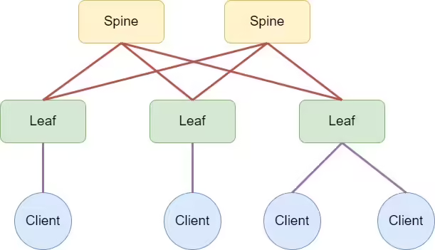

# Домашнее задание

## Проектирование адресного пространства

### Цель

- Собрать схему CLOS
- Распределить адресное пространство

---

## Описание / Пошаговая инструкция выполнения домашнего задания

В этой самостоятельной работе мы ожидаем, что вы самостоятельно:

1. Соберите топологию CLOS, как на схеме ниже:

2. Распределите адресное пространство для Underlay сети.
3. Зафиксируете в документации:
   - план работ,
   - адресное пространство,
   - схему сети,
   - настройки (если перенесли на оборудование).

# Решение

## Общие принципы
Для построения Underlay сети используется приватный диапазон адресов **10.0.0.0/8**. 
Схема адресации разработана с учетом масштабируемости и детерминированности (IP-адрес привязан к роли и номеру устройства).

- **Локация (Location ID):** `01` (в примерах ниже обозначена как `xx`)
- **Протокол маршрутизации:** BGP (предполагается eBGP для CLOS)

---

## 1. Loopback Интерфейсы
Используются для Router ID и VTEP (в случае Overlay).

**Формат:** `10.xx.y.z/32`

Где:
- `xx` = `01` (ID локации/PoD)
- `y` = Роль устройства:
  - `1` = Leaf
  - `2` = Spine
- `z` = Порядковый номер устройства (ID)

### Таблица распределения Loopback0

| Device Name | Role  | ID | IP Address      |
|-------------|-------|----|-----------------|
| Leaf-01     | Leaf  | 1  | 10.1.1.1/32     |
| Leaf-02     | Leaf  | 2  | 10.1.1.2/32     |
| Leaf-03     | Leaf  | 3  | 10.1.1.3/32     |
| Leaf-04     | Leaf  | 4  | 10.1.1.4/32     |
| Spine-01    | Spine | 1  | 10.1.2.1/32     |
| Spine-02    | Spine | 2  | 10.1.2.2/32     |

---

## 2. Point-to-Point (P2P) Линки
Используются для физических соединений между Leaf и Spine коммутаторами.

**Формат:** `10.1xx.y.z/31`

Где:
- `1xx` = `101` (Префикс P2P для локации/PoD `01`)
- `y` = ID Spine коммутатора (номер Uplink группы)
- `z` = Октеты адреса линка.

**Правило назначения сторон:**
- **Higher IP (Нечетный, .1, .3...)** -> Сторона Spine
- **Lower IP (Четный, .0, .2...)** -> Сторона Leaf

### Логика распределения по Spine-группам

#### Группа Spine-01 (y=1) -> Подсеть 10.101.1.0/24
| Link Name        | Subnet          | Leaf Side (Even/Low) | Spine Side (Odd/High) |
|------------------|-----------------|----------------------|-----------------------|
| Leaf-01 <-> Spine-01 | 10.101.1.0/31   | 10.101.1.0 (L1)      | 10.101.1.1 (S1)       |
| Leaf-02 <-> Spine-01 | 10.101.1.2/31   | 10.101.1.2 (L2)      | 10.101.1.3 (S1)       |
| Leaf-03 <-> Spine-01 | 10.101.1.4/31   | 10.101.1.4 (L3)      | 10.101.1.5 (S1)       |
| Leaf-04 <-> Spine-01 | 10.101.1.6/31   | 10.101.1.6 (L4)      | 10.101.1.7 (S1)       |

#### Группа Spine-02 (y=2) -> Подсеть 10.101.2.0/24
| Link Name        | Subnet          | Leaf Side (Even/Low) | Spine Side (Odd/High) |
|------------------|-----------------|----------------------|-----------------------|
| Leaf-01 <-> Spine-02 | 10.101.2.0/31   | 10.101.2.0 (L1)      | 10.101.2.1 (S2)       |
| Leaf-02 <-> Spine-02 | 10.101.2.2/31   | 10.101.2.2 (L2)      | 10.101.2.3 (S2)       |
| Leaf-03 <-> Spine-02 | 10.101.2.4/31   | 10.101.2.4 (L3)      | 10.101.2.5 (S2)       |
| Leaf-04 <-> Spine-02 | 10.101.2.6/31   | 10.101.2.6 (L4)      | 10.101.2.7 (S2)       |

---

## Сводная схема интерфейсов (Пример конфигурации)

### Spine-01
- **Lo0:** 10.1.2.1/32
- **Eth1 (to L1):** 10.101.1.1/31
- **Eth2 (to L2):** 10.101.1.3/31
- **Eth3 (to L3):** 10.101.1.5/31
- **Eth4 (to L4):** 10.101.1.7/31

### Leaf-01
- **Lo0:** 10.1.1.1/32
- **Eth1 (to S1):** 10.101.1.0/31
- **Eth2 (to S2):** 10.101.2.0/31
