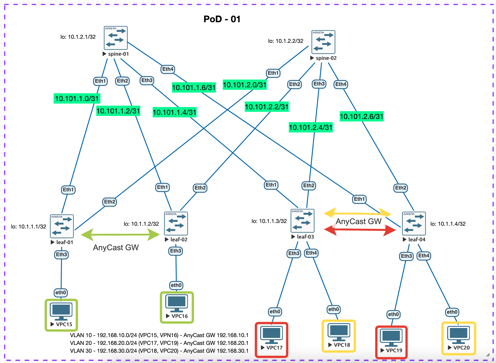

# Документация по конфигурации Lab 06 — VxLAN EVPN L3VNI (Symmetric IRB)

## Цель
Настроить **маршрутизацию между подсетями VLAN** поверх Overlay, используя:
- **VxLAN EVPN** как control-plane
- **Symmetric IRB** (L2VNI для каждого VLAN + выделенный **L3VNI** для VRF)

Схема физической топологии такая же, как в `lab05`:



---

## Архитектура

- **Underlay**: eBGP (как в `lab05/lab04`) — обеспечивает IP reachability между VTEP (Loopback0 Leaf)
- **Overlay**: BGP EVPN
- **Data plane**: VxLAN (UDP/4789)
- **VTEP**: Leaf-коммутаторы (`Loopback0` используется как VTEP IP)

---

## L2VNI (VLAN → VNI)

| VLAN | Subnet            | VNI   | Route Target | Описание |
|------|-------------------|-------|--------------|----------|
| 10   | 192.168.10.0/24   | 10010 | 10:10010     | VLAN10 |
| 20   | 192.168.20.0/24   | 10020 | 20:10020     | VLAN20 |
| 30   | 192.168.30.0/24   | 10030 | 30:10030     | VLAN30 |

---

## L3VNI (VRF → VNI)

Для symmetric IRB используется выделенный VRF и отдельный VNI:

| VRF     | L3VNI  | RT (EVPN) |
|---------|--------|-----------|
| TENANT1 | 50001  | 1:50001   |

Leaf’ы экспортируют connected-prefix’ы (SVI подсети) в EVPN как **Type-5** маршруты.

---

## Anycast Default Gateway

Для клиентов в каждом VLAN используется Anycast GW на Leaf:

| VLAN | Anycast GW IP |
|------|---------------|
| 10   | 192.168.10.1  |
| 20   | 192.168.20.1  |
| 30   | 192.168.30.1  |

На всех Leaf задан общий виртуальный MAC:
```
ip virtual-router mac-address 00:1c:73:00:00:99
```

SVI на Leaf используют:
```
ip address virtual <GW_IP>/<MASK>
```

---

## VTEP Endpoints

| Device  | Loopback0 (VTEP IP) | BGP ASN |
|---------|----------------------|--------:|
| Leaf-01 | 10.1.1.1/32          | 65001 |
| Leaf-02 | 10.1.1.2/32          | 65002 |
| Leaf-03 | 10.1.1.3/32          | 65003 |
| Leaf-04 | 10.1.1.4/32          | 65004 |
| Spine-01| 10.1.2.1/32          | 65000 |
| Spine-02| 10.1.2.2/32          | 65000 |

---

## Что добавлено относительно Lab 05

### 1) VRF + L3VNI mapping
На Leaf:
- `vrf instance TENANT1`
- `ip routing vrf TENANT1`
- `interface Vxlan1` → `vxlan vrf TENANT1 vni 50001`

### 2) SVI интерфейсы (L3 gateway)
На Leaf добавлены `interface Vlan10/20/30`, привязанные к VRF `TENANT1` и с `ip address virtual`.

### 3) BGP EVPN Type-5 (prefix routes)
На Leaf добавлен VRF блок в BGP:
```
vrf TENANT1
   rd <VTEP_IP>:50001
   route-target import evpn 1:50001
   route-target export evpn 1:50001
   !
   address-family ipv4
      redistribute connected
```

---

## Проверка

### Подготовка хостов (VPC)
Для проверок важно, чтобы на клиентах были корректные IP и default gateway (Anycast GW):

| Host  | VLAN | IP/Mask             | Default GW       |
|-------|------|---------------------|------------------|
| VPC15 | 10   | 192.168.10.15/24    | 192.168.10.1     |
| VPC16 | 10   | 192.168.10.16/24    | 192.168.10.1     |
| VPC17 | 20   | 192.168.20.17/24    | 192.168.20.1     |
| VPC19 | 20   | 192.168.20.19/24    | 192.168.20.1     |
| VPC18 | 30   | 192.168.30.18/24    | 192.168.30.1     |
| VPC20 | 30   | 192.168.30.20/24    | 192.168.30.1     |

---

### 1) Проверить маппинг VLAN→VNI и VRF→L3VNI
На Leaf:

```shell
leaf-01#show interfaces vxlan 1
Vxlan1 is up, line protocol is up (connected)
  Hardware is Vxlan
  Source interface is Loopback0 and is active with 10.1.1.1
  Listening on UDP port 4789
  Replication/Flood Mode is headend with Flood List Source: EVPN
  Remote MAC learning via EVPN
  VNI mapping to VLANs
  Static VLAN to VNI mapping is 
    [10, 10010]       [20, 10020]       [30, 10030]      
  Dynamic VLAN to VNI mapping for 'evpn' is
    [4097, 50001]    
  Note: All Dynamic VLANs used by VCS are internal VLANs.
        Use 'show vxlan vni' for details.
  Static VRF to VNI mapping is 
   [TENANT1, 50001]
  Headend replication flood vtep list is:
    10 10.1.1.3        10.1.1.4        10.1.1.2       
    20 10.1.1.3        10.1.1.4        10.1.1.2       
    30 10.1.1.3        10.1.1.4        10.1.1.2       
  Shared Router MAC is 0000.0000.0000


leaf-01#show vxlan vni
VNI to VLAN Mapping for Vxlan1
VNI         VLAN       Source       Interface       802.1Q Tag
----------- ---------- ------------ --------------- ----------
10010       10         static       Ethernet3       untagged  
                                    Vxlan1          10        
10020       20         static       Vxlan1          20        
10030       30         static       Vxlan1          30        

VNI to dynamic VLAN Mapping for Vxlan1
VNI         VLAN       VRF           Source       
----------- ---------- ------------- ------------ 
50001       4097       TENANT1       evpn         

```

### 1) Наличие маршрутов Type-5 в EVPN от нужных Leaf-коммутаторов
```bash
leaf-01#show bgp evpn detail 
....
....
BGP routing table entry for ip-prefix 192.168.10.0/24, Route Distinguisher: 10.1.1.1:50001
 Paths: 1 available
  Local
    - from - (0.0.0.0)
      Origin IGP, metric -, localpref -, weight 0, tag 0, valid, local, best, redistributed (Connected)
      Extended Community: Route-Target-AS:1:50001 TunnelEncap:tunnelTypeVxlan EvpnRouterMac:50:00:00:d7:ee:0b
      VNI: 50001
BGP routing table entry for ip-prefix 192.168.10.0/24, Route Distinguisher: 10.1.1.2:50001
 Paths: 2 available
  65000 65002
    10.1.1.2 from 10.101.1.1 (10.1.2.1)
      Origin IGP, metric -, localpref 100, weight 0, tag 0, valid, external, ECMP head, ECMP, best, ECMP contributor
      Extended Community: Route-Target-AS:1:50001 TunnelEncap:tunnelTypeVxlan EvpnRouterMac:50:00:00:cb:38:c2
      VNI: 50001
  65000 65002
    10.1.1.2 from 10.101.2.1 (10.1.2.2)
      Origin IGP, metric -, localpref 100, weight 0, tag 0, valid, external, ECMP, ECMP contributor
      Extended Community: Route-Target-AS:1:50001 TunnelEncap:tunnelTypeVxlan EvpnRouterMac:50:00:00:cb:38:c2
      VNI: 50001
BGP routing table entry for ip-prefix 192.168.20.0/24, Route Distinguisher: 10.1.1.3:50001
 Paths: 2 available
  65000 65003
    10.1.1.3 from 10.101.1.1 (10.1.2.1)
      Origin IGP, metric -, localpref 100, weight 0, tag 0, valid, external, ECMP head, ECMP, best, ECMP contributor
      Extended Community: Route-Target-AS:1:50001 TunnelEncap:tunnelTypeVxlan EvpnRouterMac:50:00:00:d5:5d:c0
      VNI: 50001
  65000 65003
    10.1.1.3 from 10.101.2.1 (10.1.2.2)
      Origin IGP, metric -, localpref 100, weight 0, tag 0, valid, external, ECMP, ECMP contributor
      Extended Community: Route-Target-AS:1:50001 TunnelEncap:tunnelTypeVxlan EvpnRouterMac:50:00:00:d5:5d:c0
      VNI: 50001
BGP routing table entry for ip-prefix 192.168.20.0/24, Route Distinguisher: 10.1.1.4:50001
 Paths: 2 available
  65000 65004
    10.1.1.4 from 10.101.2.1 (10.1.2.2)
      Origin IGP, metric -, localpref 100, weight 0, tag 0, valid, external, ECMP head, ECMP, best, ECMP contributor
      Extended Community: Route-Target-AS:1:50001 TunnelEncap:tunnelTypeVxlan EvpnRouterMac:50:00:00:03:37:66
      VNI: 50001
  65000 65004
    10.1.1.4 from 10.101.1.1 (10.1.2.1)
      Origin IGP, metric -, localpref 100, weight 0, tag 0, valid, external, ECMP, ECMP contributor
      Extended Community: Route-Target-AS:1:50001 TunnelEncap:tunnelTypeVxlan EvpnRouterMac:50:00:00:03:37:66
      VNI: 50001
BGP routing table entry for ip-prefix 192.168.30.0/24, Route Distinguisher: 10.1.1.3:50001
 Paths: 2 available
  65000 65003
    10.1.1.3 from 10.101.1.1 (10.1.2.1)
      Origin IGP, metric -, localpref 100, weight 0, tag 0, valid, external, ECMP head, ECMP, best, ECMP contributor
      Extended Community: Route-Target-AS:1:50001 TunnelEncap:tunnelTypeVxlan EvpnRouterMac:50:00:00:d5:5d:c0
      VNI: 50001
  65000 65003
    10.1.1.3 from 10.101.2.1 (10.1.2.2)
      Origin IGP, metric -, localpref 100, weight 0, tag 0, valid, external, ECMP, ECMP contributor
      Extended Community: Route-Target-AS:1:50001 TunnelEncap:tunnelTypeVxlan EvpnRouterMac:50:00:00:d5:5d:c0
      VNI: 50001
BGP routing table entry for ip-prefix 192.168.30.0/24, Route Distinguisher: 10.1.1.4:50001
 Paths: 2 available
  65000 65004
    10.1.1.4 from 10.101.2.1 (10.1.2.2)
      Origin IGP, metric -, localpref 100, weight 0, tag 0, valid, external, ECMP head, ECMP, best, ECMP contributor
      Extended Community: Route-Target-AS:1:50001 TunnelEncap:tunnelTypeVxlan EvpnRouterMac:50:00:00:03:37:66
      VNI: 50001
  65000 65004
    10.1.1.4 from 10.101.1.1 (10.1.2.1)
      Origin IGP, metric -, localpref 100, weight 0, tag 0, valid, external, ECMP, ECMP contributor
      Extended Community: Route-Target-AS:1:50001 TunnelEncap:tunnelTypeVxlan EvpnRouterMac:50:00:00:03:37:66
      VNI: 50001
```

## Результат

- **leaf-01** и **leaf-02** анонсируют сеть `192.168.10.0/24`.
- **leaf-03** и **leaf-04** анонсируют префиксы `192.168.20.0/24` и `192.168.30.0/24`.

### 3) Проверить маршруты в VRF

На Leaf:
```bash
leaf-01#show ip route vrf TENANT1

 B E      192.168.10.16/32 [200/0]
           via VTEP 10.1.1.2 VNI 50001 router-mac 50:00:00:cb:38:c2 local-interface Vxlan1
 C        192.168.10.0/24
           directly connected, Vlan10
 B E      192.168.20.17/32 [200/0]
           via VTEP 10.1.1.3 VNI 50001 router-mac 50:00:00:d5:5d:c0 local-interface Vxlan1
 B E      192.168.20.19/32 [200/0]
           via VTEP 10.1.1.4 VNI 50001 router-mac 50:00:00:03:37:66 local-interface Vxlan1
 B E      192.168.20.0/24 [200/0]
           via VTEP 10.1.1.3 VNI 50001 router-mac 50:00:00:d5:5d:c0 local-interface Vxlan1
           via VTEP 10.1.1.4 VNI 50001 router-mac 50:00:00:03:37:66 local-interface Vxlan1
 B E      192.168.30.18/32 [200/0]
           via VTEP 10.1.1.3 VNI 50001 router-mac 50:00:00:d5:5d:c0 local-interface Vxlan1
 B E      192.168.30.20/32 [200/0]
           via VTEP 10.1.1.4 VNI 50001 router-mac 50:00:00:03:37:66 local-interface Vxlan1
 B E      192.168.30.0/24 [200/0]
           via VTEP 10.1.1.3 VNI 50001 router-mac 50:00:00:d5:5d:c0 local-interface Vxlan1
           via VTEP 10.1.1.4 VNI 50001 router-mac 50:00:00:03:37:66 local-interface Vxlan1
```

### 4) Проверить L3 связность между VLAN
Пример:
- VPC15 (VLAN10) → VPC17 (VLAN20)
```shell
VPC15> show 

NAME   IP/MASK              GATEWAY                             GATEWAY
VPC15  192.168.10.15/24     192.168.10.1
       fe80::250:79ff:fe66:680f/64

VPC15> ping 192.168.20.17

84 bytes from 192.168.20.17 icmp_seq=1 ttl=62 time=73.432 ms
84 bytes from 192.168.20.17 icmp_seq=2 ttl=62 time=12.635 ms
84 bytes from 192.168.20.17 icmp_seq=3 ttl=62 time=11.167 ms
```

- VPC16 (VLAN10) → VPC18 (VLAN30)
```shell
VPC16> show

NAME   IP/MASK              GATEWAY                             GATEWAY
VPC16  192.168.10.16/24     192.168.10.1
       fe80::250:79ff:fe66:6810/64

VPC16> ping 192.168.30.18

84 bytes from 192.168.30.18 icmp_seq=1 ttl=62 time=74.965 ms
84 bytes from 192.168.30.18 icmp_seq=2 ttl=62 time=11.819 ms
84 bytes from 192.168.30.18 icmp_seq=3 ttl=62 time=11.916 ms


VPC16> trace 192.168.30.18 -P 1
trace to 192.168.30.18, 8 hops max (ICMP), press Ctrl+C to stop
 1     *  *  *
 2   192.168.20.1   8.477 ms  8.550 ms  8.201 ms
 3   192.168.30.18   10.311 ms  10.181 ms  10.079 ms

```


