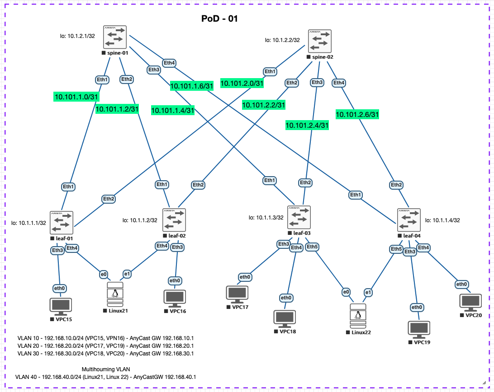

# Lab 07 — VXLAN EVPN Multihoming (ESI-LAG)

## Цель

Настроить отказоустойчивое подключение хостов Linux21 и Linux22 с использованием **EVPN Multihoming** (стандарт RFC 7432 / draft-ietf-bess-evpn-prefix-advertisement).

- **Linux21** — dual-homed на Leaf-01 (Eth4) и Leaf-02 (Eth4)
- **Linux22** — dual-homed на Leaf-03 (Eth5) и Leaf-04 (Eth5)



---

## Архитектура

### Underlay / Overlay (без изменений с Lab06)

| Уровень   | Технология                              |
|-----------|-----------------------------------------|
| Underlay  | eBGP (IPv4 unicast)                     |
| Overlay   | BGP EVPN (address-family evpn)          |
| Data plane| VXLAN UDP/4789                          |
| VTEP      | Loopback0 каждого Leaf                  |
| VRF       | TENANT1 (L3VNI 50001, Symmetric IRB)    |

### Новое в Lab07 — EVPN Multihoming

EVPN Multihoming — каждый хост подключён к двум Leaf через LACP bond. Оба Leaf в паре используют **один ESI** и **один LACP system-id**, поэтому хост воспринимает их как единый LACP-партнёр.

Механизм работы:
- **Type-4 (ES route)** — анонс Ethernet Segment от каждого Leaf, автоматический выбор **Designated Forwarder (DF)**
- **Type-1 (EAD per-ES / per-EVI)** — mass-withdraw при отказе одного из Leaf
- BUM-трафик отправляет только DF, unicast — оба Leaf (active-active)

---

## Таблица адресации

### VTEP / BGP ASN

| Device   | Loopback0 (VTEP) | BGP ASN |
|----------|------------------|---------|
| Leaf-01  | 10.1.1.1/32      | 65001   |
| Leaf-02  | 10.1.1.2/32      | 65002   |
| Leaf-03  | 10.1.1.3/32      | 65003   |
| Leaf-04  | 10.1.1.4/32      | 65004   |
| Spine-01 | 10.1.2.1/32      | 65000   |
| Spine-02 | 10.1.2.2/32      | 65000   |

### L2VNI (VLAN → VNI)

| VLAN | Subnet            | VNI   | Route-Target | Anycast GW     |
|------|-------------------|-------|--------------|----------------|
| 10   | 192.168.10.0/24   | 10010 | 10:10010     | 192.168.10.1   |
| 20   | 192.168.20.0/24   | 10020 | 20:10020     | 192.168.20.1   |
| 30   | 192.168.30.0/24   | 10030 | 30:10030     | 192.168.30.1   |
| 40   | 192.168.40.0/24   | 10040 | 40:10040     | 192.168.40.1   |

### L3VNI (VRF → VNI)

| VRF     | L3VNI | RT (EVPN) |
|---------|-------|-----------|
| TENANT1 | 50001 | 1:50001   |

### Ethernet Segments

| Хост    | Leaf-пара     | ESI                       | LACP system-id  | RT import         |
|---------|---------------|---------------------------|-----------------|-------------------|
| Linux21 | Leaf-01/02    | 0000:0000:0000:0102:0102  | 0000.0000.0102  | 00:00:00:00:01:02 |
| Linux22 | Leaf-03/04    | 0000:0000:0000:0304:0304  | 0000.0000.0304  | 00:00:00:00:03:04 |

### Хосты VLAN 40

| Host    | IP              | Gateway       |
|---------|-----------------|---------------|
| Linux21 | 192.168.40.21/24| 192.168.40.1  |
| Linux22 | 192.168.40.22/24| 192.168.40.1  |

---

## Ключевые изменения конфигураций (относительно Lab06)

### Все Leaf (01–04)

**1. VLAN 40:**
```
vlan 40
   name VLAN40
```

**2. SVI для Anycast GW:**
```
interface Vlan40
   vrf TENANT1
   ip address virtual 192.168.40.1/24
```

**3. VxLAN mapping:**
```
interface Vxlan1
   vxlan vlan 40 vni 10040
```

**4. BGP EVPN vlan 40:**
```
router bgp 6500X
   vlan 40
      rd <LOOPBACK>:10040
      route-target both 40:10040
      redistribute learned
```

### Leaf-01 и Leaf-02 (Linux21, ESI 0102)

```
interface Port-Channel1
   description Link to Linux21 (EVPN MH)
   switchport
   switchport access vlan 40
   !
   evpn ethernet-segment
      identifier 0000:0000:0000:0102:0102
      route-target import 00:00:00:00:01:02
   lacp system-id 0000.0000.0102

interface Ethernet4
   description Link to Linux21
   channel-group 1 mode active
```

> ESI и LACP system-id **идентичны** на обоих Leaf — это обязательное условие EVPN MH.

### Leaf-03 и Leaf-04 (Linux22, ESI 0304)

```
interface Port-Channel1
   description Link to Linux22 (EVPN MH)
   switchport
   switchport access vlan 40
   !
   evpn ethernet-segment
      identifier 0000:0000:0000:0304:0304
      route-target import 00:00:00:00:03:04
   lacp system-id 0000.0000.0304

interface Ethernet5
   description Link to Linux22
   channel-group 1 mode active
```

### Spine-01 / Spine-02

Изменений нет — Spine прозрачно передаёт EVPN маршруты Type-1 и Type-4.

---

## Конфигурация Linux-хостов

### Linux21

#### Вариант 1 — netplan `/etc/netplan/01-bond.yaml`

```yaml
network:
  version: 2
  renderer: networkd
  ethernets:
    ens3:
      dhcp4: false
    ens4:
      dhcp4: false
  bonds:
    bond0:
      interfaces:
        - ens3
        - ens4
      addresses:
        - 192.168.40.21/24
      routes:
        - to: default
          via: 192.168.40.1
      parameters:
        mode: 802.3ad
        lacp-rate: fast
        mii-monitor-interval: 100
```

```bash
sudo netplan apply
```

#### Вариант 2 — ip link (разовая настройка / отладка)

```bash
modprobe bonding
ip link add bond0 type bond mode 802.3ad
ip link set bond0 type bond lacp_rate fast miimon 100
ip link set ens3 down && ip link set ens3 master bond0
ip link set ens4 down && ip link set ens4 master bond0
ip link set bond0 up
ip addr add 192.168.40.21/24 dev bond0
ip route add default via 192.168.40.1
```

---

### Linux22

#### Вариант 1 — netplan `/etc/netplan/01-bond.yaml`

```yaml
network:
  version: 2
  renderer: networkd
  ethernets:
    ens3:
      dhcp4: false
    ens4:
      dhcp4: false
  bonds:
    bond0:
      interfaces:
        - ens3
        - ens4
      addresses:
        - 192.168.40.22/24
      routes:
        - to: default
          via: 192.168.40.1
      parameters:
        mode: 802.3ad
        lacp-rate: fast
        mii-monitor-interval: 100
```

```bash
sudo netplan apply
```

#### Вариант 2 — ip link (разовая настройка / отладка)

```bash
modprobe bonding
ip link add bond0 type bond mode 802.3ad
ip link set bond0 type bond lacp_rate fast miimon 100
ip link set ens3 down && ip link set ens3 master bond0
ip link set ens4 down && ip link set ens4 master bond0
ip link set bond0 up
ip addr add 192.168.40.22/24 dev bond0
ip route add default via 192.168.40.1
```

---

## Проверка

### 1. LACP Port-Channel на Leaf-ах

```bash
leaf-01#show port-channel 1 detailed
Port Channel Port-Channel1 (Fallback State: Unconfigured):
Minimum links: unconfigured
Minimum speed: unconfigured
Current weight/Max weight: 1/16
  Active Ports:
     Port         Time Became Active     Protocol     Mode       Weight   State
    ------------ --------------------- ------------ ---------- ---------- -----
     Ethernet4    16:01:32               LACP         Active       1      Rx,Tx


leaf-03#show port-channel 1 detailed
Port Channel Port-Channel1 (Fallback State: Unconfigured):
Minimum links: unconfigured
Minimum speed: unconfigured
Current weight/Max weight: 1/16
  Active Ports:
     Port         Time Became Active     Protocol     Mode       Weight   State
    ------------ --------------------- ------------ ---------- ---------- -----
     Ethernet5    16:17:52               LACP         Active       1      Rx,Tx
```


### 2. Ethernet Segment routes (Type-4) в EVPN

```bash
leaf-01#show bgp evpn route-type ethernet-segment
BGP routing table information for VRF default
Router identifier 10.1.1.1, local AS number 65001
Route status codes: * - valid, > - active, S - Stale, E - ECMP head, e - ECMP
                    c - Contributing to ECMP, % - Pending best path selection
Origin codes: i - IGP, e - EGP, ? - incomplete
AS Path Attributes: Or-ID - Originator ID, C-LST - Cluster List, LL Nexthop - Link Local Nexthop

          Network                Next Hop              Metric  LocPref Weight  Path
 * >      RD: 10.1.1.1:1 ethernet-segment 0000:0000:0000:0102:0102 10.1.1.1
                                 -                     -       -       0       i
 * >Ec    RD: 10.1.1.2:1 ethernet-segment 0000:0000:0000:0102:0102 10.1.1.2
                                 10.1.1.2              -       100     0       65000 65002 i
 *  ec    RD: 10.1.1.2:1 ethernet-segment 0000:0000:0000:0102:0102 10.1.1.2
                                 10.1.1.2              -       100     0       65000 65002 i
 * >Ec    RD: 10.1.1.3:1 ethernet-segment 0000:0000:0000:0304:0304 10.1.1.3
                                 10.1.1.3              -       100     0       65000 65003 i
 *  ec    RD: 10.1.1.3:1 ethernet-segment 0000:0000:0000:0304:0304 10.1.1.3
                                 10.1.1.3              -       100     0       65000 65003 i
 * >Ec    RD: 10.1.1.4:1 ethernet-segment 0000:0000:0000:0304:0304 10.1.1.4
                                 10.1.1.4              -       100     0       65000 65004 i
 *  ec    RD: 10.1.1.4:1 ethernet-segment 0000:0000:0000:0304:0304 10.1.1.4
                                 10.1.1.4              -       100     0       65000 65004 i
```

Видим: ES на Leaf01-02 и Leaf03-04

### 3. EAD routes (Type-1) в EVPN

```bash
leaf-01# show bgp evpn route-type auto-discovery
BGP routing table information for VRF default
Router identifier 10.1.1.1, local AS number 65001
Route status codes: * - valid, > - active, S - Stale, E - ECMP head, e - ECMP
                    c - Contributing to ECMP, % - Pending best path selection
Origin codes: i - IGP, e - EGP, ? - incomplete
AS Path Attributes: Or-ID - Originator ID, C-LST - Cluster List, LL Nexthop - Link Local Nexthop

          Network                Next Hop              Metric  LocPref Weight  Path
 * >      RD: 10.1.1.1:10040 auto-discovery 0 0000:0000:0000:0102:0102
                                 -                     -       -       0       i
 * >Ec    RD: 10.1.1.2:10040 auto-discovery 0 0000:0000:0000:0102:0102
                                 10.1.1.2              -       100     0       65000 65002 i
 *  ec    RD: 10.1.1.2:10040 auto-discovery 0 0000:0000:0000:0102:0102
                                 10.1.1.2              -       100     0       65000 65002 i
 * >      RD: 10.1.1.1:1 auto-discovery 0000:0000:0000:0102:0102
                                 -                     -       -       0       i
 * >Ec    RD: 10.1.1.2:1 auto-discovery 0000:0000:0000:0102:0102
                                 10.1.1.2              -       100     0       65000 65002 i
 *  ec    RD: 10.1.1.2:1 auto-discovery 0000:0000:0000:0102:0102
                                 10.1.1.2              -       100     0       65000 65002 i
 * >Ec    RD: 10.1.1.3:10040 auto-discovery 0 0000:0000:0000:0304:0304
                                 10.1.1.3              -       100     0       65000 65003 i
 *  ec    RD: 10.1.1.3:10040 auto-discovery 0 0000:0000:0000:0304:0304
                                 10.1.1.3              -       100     0       65000 65003 i
 * >Ec    RD: 10.1.1.4:10040 auto-discovery 0 0000:0000:0000:0304:0304
                                 10.1.1.4              -       100     0       65000 65004 i
 *  ec    RD: 10.1.1.4:10040 auto-discovery 0 0000:0000:0000:0304:0304
                                 10.1.1.4              -       100     0       65000 65004 i
 * >Ec    RD: 10.1.1.3:1 auto-discovery 0000:0000:0000:0304:0304
                                 10.1.1.3              -       100     0       65000 65003 i
 *  ec    RD: 10.1.1.3:1 auto-discovery 0000:0000:0000:0304:0304
                                 10.1.1.3              -       100     0       65000 65003 i
 * >Ec    RD: 10.1.1.4:1 auto-discovery 0000:0000:0000:0304:0304
                                 10.1.1.4              -       100     0       65000 65004 i
 *  ec    RD: 10.1.1.4:1 auto-discovery 0000:0000:0000:0304:0304
                                 10.1.1.4              -       100     0       65000 65004 i
```

Видим: EAD per-ES и EAD per-EVI для каждого ESI.

### 4. Designated Forwarder

```bash
leaf-01#show bgp evpn instance
EVPN instance: VLAN 10
  Route distinguisher: 10.1.1.1:10010
  Route target import: Route-Target-AS:10:10010
  Route target export: Route-Target-AS:10:10010
  Service interface: VLAN-based
  Local VXLAN IP address: 10.1.1.1
  VXLAN: enabled
  MPLS: disabled
EVPN instance: VLAN 20
  Route distinguisher: 10.1.1.1:10020
  Route target import: Route-Target-AS:20:10020
  Route target export: Route-Target-AS:20:10020
  Service interface: VLAN-based
  Local VXLAN IP address: 10.1.1.1
  VXLAN: enabled
  MPLS: disabled
EVPN instance: VLAN 30
  Route distinguisher: 10.1.1.1:10030
  Route target import: Route-Target-AS:30:10030
  Route target export: Route-Target-AS:30:10030
  Service interface: VLAN-based
  Local VXLAN IP address: 10.1.1.1
  VXLAN: enabled
  MPLS: disabled
EVPN instance: VLAN 40
  Route distinguisher: 10.1.1.1:10040
  Route target import: Route-Target-AS:40:10040
  Route target export: Route-Target-AS:40:10040
  Service interface: VLAN-based
  Local VXLAN IP address: 10.1.1.1
  VXLAN: enabled
  MPLS: disabled
  Remote ethernet segment:
    ESI: 0000:0000:0000:0304:0304
    Active TEPs: 10.1.1.3, 10.1.1.4
  Local ethernet segment:
    ESI: 0000:0000:0000:0102:0102
      Type: 0 (administratively configured)
      Interface: Port-Channel1
      Mode: all-active
      State: up
      ES-Import RT: 00:00:00:00:01:02
      DF election algorithm: modulus
      Designated forwarder: 10.1.1.1
      Non-Designated forwarder: 10.1.1.2
```

### 5. VNI mapping

```bash
leaf-01# show interfaces vxlan 1

Vxlan1 is up, line protocol is up (connected)
  Hardware is Vxlan
  Source interface is Loopback0 and is active with 10.1.1.1
  Listening on UDP port 4789
  Replication/Flood Mode is headend with Flood List Source: EVPN
  Remote MAC learning via EVPN
  VNI mapping to VLANs
  Static VLAN to VNI mapping is 
    [10, 10010]       [20, 10020]       [30, 10030]       [40, 10040]      
   
  Dynamic VLAN to VNI mapping for 'evpn' is
    [4097, 50001]    
  Note: All Dynamic VLANs used by VCS are internal VLANs.
        Use 'show vxlan vni' for details.
  Static VRF to VNI mapping is 
   [TENANT1, 50001]
  Headend replication flood vtep list is:
    10 10.1.1.3        10.1.1.4        10.1.1.2       
    20 10.1.1.3        10.1.1.4        10.1.1.2       
    30 10.1.1.3        10.1.1.4        10.1.1.2       
--> 40 10.1.1.3        10.1.1.4        10.1.1.2       
  Shared Router MAC is 0000.0000.0000```

### 6. L2 связность (в пределах VLAN 40)

```bash
Linux21# ping 192.168.40.1
PING 192.168.40.1 (192.168.40.1) 56(84) bytes of data.
64 bytes from 192.168.40.1: icmp_seq=1 ttl=64 time=4.69 ms
64 bytes from 192.168.40.1: icmp_seq=2 ttl=64 time=3.24 ms
```

### 7. L3 связность между VLAN (через Symmetric IRB)

```bash
Linux21# ping 192.168.10.15       # VPC15 (VLAN 10)
PING 192.168.10.15 (192.168.10.15) 56(84) bytes of data.
64 bytes from 192.168.10.15: icmp_seq=1 ttl=63 time=10.8 ms
64 bytes from 192.168.10.15: icmp_seq=2 ttl=63 time=5.17 ms
^C


Linux21#  ping 192.168.20.17      # VPC17 (VLAN 20)
PING 192.168.20.17 (192.168.20.17) 56(84) bytes of data.
64 bytes from 192.168.20.17: icmp_seq=1 ttl=62 time=22.8 ms
64 bytes from 192.168.20.17: icmp_seq=2 ttl=62 time=19.5 ms
64 bytes from 192.168.20.17: icmp_seq=3 ttl=62 time=11.8 ms
^C
```

### 8. Тест отказоустойчивости

```bash
# Отключить один аплинк на Linux21
leaf-01(config)# interface Ethernet4
leaf-01(config-if)# shutdown

# Проверить, что трафик продолжает идти через Leaf-02
Linux21# ip -c link show
3: ens3: <BROADCAST,MULTICAST,SLAVE> mtu 1500 qdisc fq_codel master bond0 state >>DOWN<< mode DEFAULT group default qlen 1000
    link/ether 00:50:00:00:15:01 brd ff:ff:ff:ff:ff:ff
    altname enp0s4
    altname enx005000001501
4: ens4: <BROADCAST,MULTICAST,SLAVE,UP,LOWER_UP> mtu 1500 qdisc fq_codel master bond0 state UP mode DEFAULT group default qlen 1000
    link/ether 00:50:00:00:15:01 brd ff:ff:ff:ff:ff:ff permaddr 00:50:00:00:15:02
    altname enp0s5
    altname enx005000001502


Linux21# ping 192.168.40.22
PING 192.168.40.22 (192.168.40.22) 56(84) bytes of data.
64 bytes from 192.168.40.22: icmp_seq=1 ttl=64 time=19.9 ms
64 bytes from 192.168.40.22: icmp_seq=2 ttl=64 time=12.0 ms
64 bytes from 192.168.40.22: icmp_seq=3 ttl=64 time=10.6 ms
64 bytes from 192.168.40.22: icmp_seq=4 ttl=64 time=11.8 ms
```

После выхода порта ens4 из Bonding связность не пропала
Удалённый хост Linux22 доступен

---

## Результат

- Хосты Linux21 и Linux22 подключены к фабрике через EVPN Multihoming (active-active ESI-LAG)
- VLAN 40 растянут по всей фабрике через L2VNI 10040
- L3-маршрутизация между VLAN 10/20/30/40 работает через Symmetric IRB (L3VNI 50001, VRF TENANT1)
- При отказе одного из Leaf в паре трафик автоматически переходит на оставшийся без ручного вмешательства
