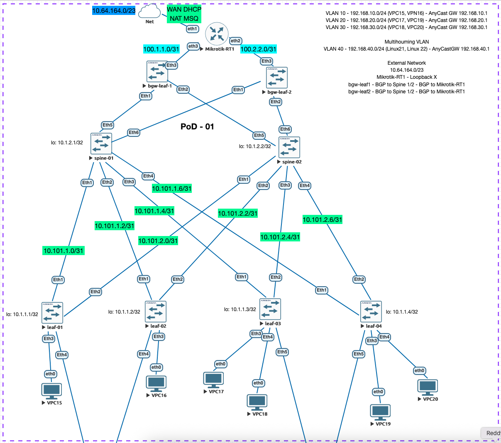

# Lab 08 — VxLAN EVPN Type-5: Border Gateway Leaf + External Routing

## Цель

Обеспечить **маршрутизацию из фабрики к внешней сети** через Border Gateway Leaf коммутаторы (`bgw-leaf-1`, `bgw-leaf-2`), подключённые к внешнему маршрутизатору `Mikrotik-RT1`.

- `Mikrotik-RT1` получает WAN адрес по DHCP и выполняет NAT masquerade, обеспечивая всей фабрике доступ к внешней сети `10.64.164.0/23` с одного IP.
- `Mikrotik-RT1` анонсирует **default route** (`0.0.0.0/0`) через eBGP на bgw-leaf.
- `bgw-leaf-1/2` получают default route, импортируют его в VRF `TENANT1` и распространяют его по фабрике как **EVPN Type-5** маршрут.
- Все Leaf-коммутаторы фабрики автоматически получают default route через EVPN.



---

## Архитектура

```
WAN (10.64.164.0/23 DHCP + NAT)
          |
    [Mikrotik-RT1] AS 65100
     ether2          ether3
  100.1.1.1/31    100.2.2.1/31
       |                  |
  [bgw-leaf-1]      [bgw-leaf-2]
   AS 65005          AS 65006
   Lo: 10.1.1.5      Lo: 10.1.1.6
   Eth1/Eth2         Eth1/Eth2
     |  |              |  |
  Spine-01          Spine-02
  AS 65000          AS 65000
   Lo: 10.1.2.1      Lo: 10.1.2.2
        |   \          /   |
      leaf-01..04 (AS 65001-65004)
         VRF TENANT1 / L3VNI 50001
```

### Ключевые компоненты

| Компонент | Роль |
|-----------|------|
| **bgw-leaf** | Border Gateway: участвует в EVPN overlay, импортирует default route из BGP пиринга с Mikrotik в VRF TENANT1, экспортирует как EVPN Type-5 |
| **Mikrotik-RT1** | Внешний маршрутизатор: WAN DHCP, NAT masquerade, eBGP с default-originate |
| **Spine** | Route Reflector для EVPN (next-hop-unchanged), пересылает Type-5 маршруты между leaf и bgw-leaf |
| **Leaf-01..04** | Получают default route через EVPN Type-5, трафик к внешней сети идёт в VRF TENANT1 через L3VNI |

---

## Адресация

### Loopback / BGP ASN

| Device     | Loopback0    | BGP ASN |
|------------|--------------|---------|
| spine-01   | 10.1.2.1/32  | 65000   |
| spine-02   | 10.1.2.2/32  | 65000   |
| leaf-01    | 10.1.1.1/32  | 65001   |
| leaf-02    | 10.1.1.2/32  | 65002   |
| leaf-03    | 10.1.1.3/32  | 65003   |
| leaf-04    | 10.1.1.4/32  | 65004   |
| bgw-leaf-1 | 10.1.1.5/32  | 65005   |
| bgw-leaf-2 | 10.1.1.6/32  | 65006   |
| Mikrotik-RT1 | 10.1.3.1/32 (loopback) | 65100 |

### P2P линки Spine — BGW-Leaf (новые)

| Линк                    | Spine Port | Spine IP        | BGW Port | BGW IP          |
|-------------------------|------------|-----------------|----------|-----------------|
| Spine-01 — bgw-leaf-1   | Eth5       | 10.101.1.9/31   | Eth1     | 10.101.1.8/31   |
| Spine-01 — bgw-leaf-2   | Eth6       | 10.101.1.11/31  | Eth1     | 10.101.1.10/31  |
| Spine-02 — bgw-leaf-1   | Eth5       | 10.101.2.9/31   | Eth2     | 10.101.2.8/31   |
| Spine-02 — bgw-leaf-2   | Eth6       | 10.101.2.11/31  | Eth2     | 10.101.2.10/31  |

### Внешние линки BGW-Leaf — Mikrotik

| Линк                      | BGW Port | BGW IP        | Mikrotik Port | Mikrotik IP   |
|---------------------------|----------|---------------|---------------|---------------|
| bgw-leaf-1 — Mikrotik-RT1 | Eth3     | 100.1.1.0/31  | ether2        | 100.1.1.1/31  |
| bgw-leaf-2 — Mikrotik-RT1 | Eth3     | 100.2.2.0/31  | ether3        | 100.2.2.1/31  |

### P2P линки Spine — Leaf (из lab07, без изменений)

| Линк             | Spine Port | Spine IP        | Leaf Port | Leaf IP         |
|------------------|------------|-----------------|-----------|-----------------|
| Spine-01 — Leaf-01 | Eth1     | 10.101.1.1/31   | Eth1      | 10.101.1.0/31   |
| Spine-01 — Leaf-02 | Eth2     | 10.101.1.3/31   | Eth1      | 10.101.1.2/31   |
| Spine-01 — Leaf-03 | Eth3     | 10.101.1.5/31   | Eth1      | 10.101.1.4/31   |
| Spine-01 — Leaf-04 | Eth4     | 10.101.1.7/31   | Eth1      | 10.101.1.6/31   |
| Spine-02 — Leaf-01 | Eth1     | 10.101.2.1/31   | Eth2      | 10.101.2.0/31   |
| Spine-02 — Leaf-02 | Eth2     | 10.101.2.3/31   | Eth2      | 10.101.2.2/31   |
| Spine-02 — Leaf-03 | Eth3     | 10.101.2.5/31   | Eth2      | 10.101.2.4/31   |
| Spine-02 — Leaf-04 | Eth4     | 10.101.2.7/31   | Eth2      | 10.101.2.6/31   |

### VNI / VRF

| VRF     | L3VNI | RT (EVPN) | Назначение |
|---------|-------|-----------|------------|
| TENANT1 | 50001 | 1:50001   | Маршрутизация всех клиентских подсетей + default route |

| VLAN | Subnet            | L2VNI | Route Target |
|------|-------------------|-------|--------------|
| 10   | 192.168.10.0/24   | 10010 | 10:10010     |
| 20   | 192.168.20.0/24   | 10020 | 20:10020     |
| 30   | 192.168.30.0/24   | 10030 | 30:10030     |
| 40   | 192.168.40.0/24   | 10040 | 40:10040     |

### Адреса хостов (VPC)

| Host    | VLAN | IP/Mask             | Default GW    |
|---------|------|---------------------|---------------|
| VPC15   | 10   | 192.168.10.15/24    | 192.168.10.1  |
| VPC16   | 10   | 192.168.10.16/24    | 192.168.10.1  |
| VPC17   | 20   | 192.168.20.17/24    | 192.168.20.1  |
| VPC19   | 20   | 192.168.20.19/24    | 192.168.20.1  |
| VPC18   | 30   | 192.168.30.18/24    | 192.168.30.1  |
| VPC20   | 30   | 192.168.30.20/24    | 192.168.30.1  |
| Linux21 | 40   | 192.168.40.21/24    | 192.168.40.1  |
| Linux22 | 40   | 192.168.40.22/24    | 192.168.40.1  |

---

## Что изменено относительно Lab 07

### 1. Новые устройства: bgw-leaf-1, bgw-leaf-2 (Arista EOS)

- Только L3VNI (50001) в VRF `TENANT1` — без L2VNI/VLAN/SVI.
- eBGP пиринг с Spine-01/02 для underlay IPv4 и EVPN overlay.
- Eth3 (routed port в VRF `TENANT1`) — внешний линк к Mikrotik-RT1.
- eBGP пиринг с Mikrotik-RT1 в VRF `TENANT1`:
  - Получает `0.0.0.0/0` (default route) с `default-originate=always`.
  - Анонсирует connected префиксы (100.1.1.x / 100.2.2.x) обратно.
- Default route импортируется в VRF и экспортируется в EVPN как **Type-5** маршрут с RT `1:50001`.

### 2. Обновлены: spine-01, spine-02

- Добавлены Eth5/Eth6 с пирингом на bgw-leaf-1/2.
- `maximum-paths` увеличен с `4` до `6` (ecmp 6).

### 3. Новое устройство: Mikrotik-RT1 (RouterOS 7)

- ether1: WAN DHCP + NAT masquerade (srcnat → ether1).
- ether2/ether3: eBGP peering с bgw-leaf-1/2.
- `output.default-originate=always` — анонсирует default route обоим BGW.
- `output.redistribute=connected,static` — отдаёт подключённые маршруты.

### 4. Leaf-01..04 — без изменений

Default route `0.0.0.0/0` приходит автоматически через EVPN Type-5 в VRF TENANT1.

---

## EVPN Type-5 Flow: путь default route

```
Mikrotik-RT1
  └─ eBGP: 0.0.0.0/0 → bgw-leaf-1 (VRF TENANT1, NH=100.1.1.1)
               └─ VRF TENANT1: default route появляется в таблице
                    └─ EVPN Type-5 export (RT 1:50001, VNI 50001, NH=10.1.1.5)
                         └─ eBGP EVPN → Spine-01/02
                              └─ next-hop-unchanged → Leaf-01..04 (VRF TENANT1)
                                   └─ 0.0.0.0/0 via VTEP 10.1.1.5 VNI 50001
```

Трафик от VPC к WAN (пример VPC15 → 8.8.8.8):
```
VPC15 → Leaf-01 (VLAN10 → VRF TENANT1)
  → VxLAN инкапсуляция (L3VNI 50001) → bgw-leaf-1 (VTEP 10.1.1.5) или bgw-leaf-2 (VTEP 10.1.1.6) - ECMP
    → декапсуляция, маршрутизация в VRF TENANT1 → Eth3 → Mikrotik-RT1
      → NAT masquerade → ether1 → WAN
```

---

## Проверка

### 1. BGP EVPN соседства (Spine)

```bash
spine-01# show bgp evpn summary

BGP summary information for VRF default
Router identifier 10.1.2.1, local AS number 65000
Neighbor Status Codes: m - Under maintenance
  Description              Neighbor    V AS           MsgRcvd   MsgSent  InQ OutQ  Up/Down State   PfxRcd PfxAcc
  Leaf-01                  10.101.1.0  4 65001            166       177    0    0 00:06:21 Estab   6      6
  Leaf-02                  10.101.1.2  4 65002            163       178    0    0 00:06:21 Estab   6      6
  Leaf-03                  10.101.1.4  4 65003            165       178    0    0 00:06:21 Estab   7      7
  Leaf-04                  10.101.1.6  4 65004            163       179    0    0 00:06:21 Estab   7      7
  bgw-leaf-1               10.101.1.8  4 65005            185       178    0    0 00:06:15 Estab   5      5
  bgw-leaf-2               10.101.1.10 4 65006            163       182    0    0 00:06:22 Estab   5      5

```
**Результат:**
- Все 6 соседей (leaf-01..04, bgw-leaf-1, bgw-leaf-2) в состоянии **Estab**.
- `PfxRcd > 0` у bgw-leaf — они присылают Type-5 маршруты.

### 2. BGP сессия Mikrotik-RT1 (BGW-Leaf)

```bash
bgw-leaf-1#show ip bgp summary vrf TENANT1

BGP summary information for VRF TENANT1
Router identifier 100.1.1.0, local AS number 65005
Neighbor Status Codes: m - Under maintenance
  Description              Neighbor  V AS           MsgRcvd   MsgSent  InQ OutQ  Up/Down State   PfxRcd PfxAcc
  Mikrotik-RT1             100.1.1.1 4 65100            178       204    0    0 00:08:22 Estab   5      5

```
**Результат:**
- Сосед `100.1.1.1` (Mikrotik) в **Estab**.
- `PfxRcd >= 1` — получен default route `0.0.0.0/0` и доп маршруты (сеть 10.64.164.0/23 + loopback).

### 3. Таблица маршрутизации VRF TENANT1 на BGW-Leaf

```bash
bgw-leaf-1#show ip route vrf TENANT1

VRF: TENANT1
Source Codes:
       C - connected, S - static, K - kernel,
       O - OSPF, IA - OSPF inter area, E1 - OSPF external type 1,
       E2 - OSPF external type 2, N1 - OSPF NSSA external type 1,
       N2 - OSPF NSSA external type2, B - Other BGP Routes,
       B I - iBGP, B E - eBGP, R - RIP, I L1 - IS-IS level 1,
       I L2 - IS-IS level 2, O3 - OSPFv3, A B - BGP Aggregate,
       A O - OSPF Summary, NG - Nexthop Group Static Route,
       V - VXLAN Control Service, M - Martian,
       DH - DHCP client installed default route,
       DP - Dynamic Policy Route, L - VRF Leaked,
       G  - gRIBI, RC - Route Cache Route,
       CL - CBF Leaked Route

Gateway of last resort:
 B E      0.0.0.0/0 [200/0]
           via 100.1.1.1, Ethernet3

 B E      10.1.3.1/32 [200/0]
           via 100.1.1.1, Ethernet3
 B E      10.64.164.0/23 [200/0]
           via 100.1.1.1, Ethernet3
 C        100.1.1.0/31
           directly connected, Ethernet3
 B E      100.2.2.0/31 [200/0]
           via 100.1.1.1, Ethernet3
 B E      192.168.10.0/24 [200/0]
           via VTEP 10.1.1.1 VNI 50001 router-mac 50:00:00:d7:ee:0b local-interface Vxlan1
           via VTEP 10.1.1.2 VNI 50001 router-mac 50:00:00:cb:38:c2 local-interface Vxlan1
 B E      192.168.20.0/24 [200/0]
           via VTEP 10.1.1.3 VNI 50001 router-mac 50:00:00:d5:5d:c0 local-interface Vxlan1
           via VTEP 10.1.1.4 VNI 50001 router-mac 50:00:00:03:37:66 local-interface Vxlan1
 B E      192.168.30.0/24 [200/0]
           via VTEP 10.1.1.3 VNI 50001 router-mac 50:00:00:d5:5d:c0 local-interface Vxlan1
           via VTEP 10.1.1.4 VNI 50001 router-mac 50:00:00:03:37:66 local-interface Vxlan1
 B E      192.168.40.0/24 [200/0]
           via VTEP 10.1.1.1 VNI 50001 router-mac 50:00:00:d7:ee:0b local-interface Vxlan1
           via VTEP 10.1.1.3 VNI 50001 router-mac 50:00:00:d5:5d:c0 local-interface Vxlan1

```
**Результат:**
Default route получен от Mikrotik через eBGP.

### 4. Проверка EVPN Type-5 маршрутов (Leaf)

```bash
leaf-01#show bgp evpn route-type ip-prefix ipv4

BGP routing table information for VRF default
Router identifier 10.1.1.1, local AS number 65001
Route status codes: * - valid, > - active, S - Stale, E - ECMP head, e - ECMP
                    c - Contributing to ECMP, % - Pending best path selection
Origin codes: i - IGP, e - EGP, ? - incomplete
AS Path Attributes: Or-ID - Originator ID, C-LST - Cluster List, LL Nexthop - Link Local Nexthop

          Network                Next Hop              Metric  LocPref Weight  Path
 * >Ec    RD: 10.1.1.5:50001 ip-prefix 0.0.0.0/0
                                 10.1.1.5              -       100     0       65000 65005 65100 i
 *  ec    RD: 10.1.1.5:50001 ip-prefix 0.0.0.0/0
                                 10.1.1.5              -       100     0       65000 65005 65100 i
 * >Ec    RD: 10.1.1.6:50001 ip-prefix 0.0.0.0/0
                                 10.1.1.6              -       100     0       65000 65006 65100 i
 *  ec    RD: 10.1.1.6:50001 ip-prefix 0.0.0.0/0
                                 10.1.1.6              -       100     0       65000 65006 65100 i
 * >Ec    RD: 10.1.1.5:50001 ip-prefix 10.1.3.1/32
                                 10.1.1.5              -       100     0       65000 65005 65100 i
 *  ec    RD: 10.1.1.5:50001 ip-prefix 10.1.3.1/32
                                 10.1.1.5              -       100     0       65000 65005 65100 i
 * >Ec    RD: 10.1.1.6:50001 ip-prefix 10.1.3.1/32
                                 10.1.1.6              -       100     0       65000 65006 65100 i
 *  ec    RD: 10.1.1.6:50001 ip-prefix 10.1.3.1/32
                                 10.1.1.6              -       100     0       65000 65006 65100 i
 * >Ec    RD: 10.1.1.5:50001 ip-prefix 10.64.164.0/23
                                 10.1.1.5              -       100     0       65000 65005 65100 i
 *  ec    RD: 10.1.1.5:50001 ip-prefix 10.64.164.0/23
                                 10.1.1.5              -       100     0       65000 65005 65100 i
 * >Ec    RD: 10.1.1.6:50001 ip-prefix 10.64.164.0/23
                                 10.1.1.6              -       100     0       65000 65006 65100 i
 *  ec    RD: 10.1.1.6:50001 ip-prefix 10.64.164.0/23
                                 10.1.1.6              -       100     0       65000 65006 65100 i
...
```
**Результат:**
- Присутствует `ip-prefix 0.0.0.0/0` с RD `10.1.1.5:50001` и `10.1.1.6:50001`.
- RT = `1:50001`, VNI = `50001`.
- Next-hop = `10.1.1.5` и `10.1.1.6` (VTEP IP bgw-leaf).
- Присутствует сеть `10.64.164.0/23` также с Next-hop = `10.1.1.5` и `10.1.1.6`

### 5. Таблица маршрутизации VRF TENANT1 на Leaf

```bash
leaf-01#show ip route vrf TENANT1

VRF: TENANT1
Source Codes:
       C - connected, S - static, K - kernel,
       O - OSPF, IA - OSPF inter area, E1 - OSPF external type 1,
       E2 - OSPF external type 2, N1 - OSPF NSSA external type 1,
       N2 - OSPF NSSA external type2, B - Other BGP Routes,
       B I - iBGP, B E - eBGP, R - RIP, I L1 - IS-IS level 1,
       I L2 - IS-IS level 2, O3 - OSPFv3, A B - BGP Aggregate,
       A O - OSPF Summary, NG - Nexthop Group Static Route,
       V - VXLAN Control Service, M - Martian,
       DH - DHCP client installed default route,
       DP - Dynamic Policy Route, L - VRF Leaked,
       G  - gRIBI, RC - Route Cache Route,
       CL - CBF Leaked Route

Gateway of last resort:
 B E      0.0.0.0/0 [200/0]
           via VTEP 10.1.1.6 VNI 50001 router-mac 50:00:00:75:d4:34 local-interface Vxlan1
           via VTEP 10.1.1.5 VNI 50001 router-mac 50:00:00:a1:33:1a local-interface Vxlan1

 B E      10.1.3.1/32 [200/0]
           via VTEP 10.1.1.6 VNI 50001 router-mac 50:00:00:75:d4:34 local-interface Vxlan1
           via VTEP 10.1.1.5 VNI 50001 router-mac 50:00:00:a1:33:1a local-interface Vxlan1
 B E      10.64.164.0/23 [200/0]
           via VTEP 10.1.1.6 VNI 50001 router-mac 50:00:00:75:d4:34 local-interface Vxlan1
           via VTEP 10.1.1.5 VNI 50001 router-mac 50:00:00:a1:33:1a local-interface Vxlan1
 B E      100.1.1.0/31 [200/0]
           via VTEP 10.1.1.5 VNI 50001 router-mac 50:00:00:a1:33:1a local-interface Vxlan1
 B E      100.2.2.0/31 [200/0]
           via VTEP 10.1.1.6 VNI 50001 router-mac 50:00:00:75:d4:34 local-interface Vxlan1
 C        192.168.10.0/24
           directly connected, Vlan10
 B E      192.168.20.0/24 [200/0]
           via VTEP 10.1.1.4 VNI 50001 router-mac 50:00:00:03:37:66 local-interface Vxlan1
           via VTEP 10.1.1.3 VNI 50001 router-mac 50:00:00:d5:5d:c0 local-interface Vxlan1
 B E      192.168.30.0/24 [200/0]
           via VTEP 10.1.1.4 VNI 50001 router-mac 50:00:00:03:37:66 local-interface Vxlan1
           via VTEP 10.1.1.3 VNI 50001 router-mac 50:00:00:d5:5d:c0 local-interface Vxlan1
 C        192.168.40.0/24
           directly connected, Vlan40
```
**Результат:**
Default route идёт через L3VNI на bgw-leaf — это подтверждает работу Type-5.

### 6. Проверка VxLAN маппинга VRF (BGW-Leaf)

```bash
bgw-leaf-1#show vxlan vni
VNI to VLAN Mapping for Vxlan1
VNI       VLAN       Source       Interface       802.1Q Tag
--------- ---------- ------------ --------------- ----------

VNI to dynamic VLAN Mapping for Vxlan1
VNI         VLAN       VRF           Source       
----------- ---------- ------------- ------------ 
50001       4097       TENANT1       evpn         


bgw-leaf-1#show interfaces vxlan 1

Vxlan1 is up, line protocol is up (connected)
  Hardware is Vxlan
  Source interface is Loopback0 and is active with 10.1.1.5
  Listening on UDP port 4789
  Replication/Flood Mode is headend with Flood List Source: CLI
  Remote MAC learning is disabled
  VNI mapping to VLANs
  Static VLAN to VNI mapping is 
  Dynamic VLAN to VNI mapping for 'evpn' is
    [4097, 50001]    
  Note: All Dynamic VLANs used by VCS are internal VLANs.
        Use 'show vxlan vni' for details.
  Static VRF to VNI mapping is 
   [TENANT1, 50001]
  Shared Router MAC is 0000.0000.0000

```
**Результат:**
- VRF `TENANT1` → VNI `50001`.
- Нет L2VNI (bgw-leaf — чистый L3 gateway).

### 7. BGP таблица Mikrotik-RT1

```
[admin@MikroTik] > /routing/bgp/session print
Flags: E - established 
 0 E name="to-bgw-leaf-2-1" 
     remote.address=100.2.2.0 .as=65006 .id=100.2.2.0 .capabilities=mp,rr,gr,as4,ap,err .afi=ip .hold-time=9s .messages=360 .bytes=6999 .gr-time=300 .eor=ip 
     local.address=100.2.2.1 .as=65100 .id=10.1.3.1 .cluster-id=10.1.3.1 .capabilities=mp,rr,gr,as4 .afi=ip .messages=308 .bytes=6038 .eor="" 
     output.procid=20 .default-originate=always .last-notification=ffffffffffffffffffffffffffffffff0015030400 
     input.procid=20 ebgp 
     hold-time=9s keepalive-time=3s uptime=15m8s180ms last-started=2026-03-04 04:42:06 last-stopped=2026-03-04 04:36:46 prefix-count=6 

 1 E name="to-bgw-leaf-1-1" 
     remote.address=100.1.1.0 .as=65005 .id=100.1.1.0 .capabilities=mp,rr,gr,as4,ap,err .afi=ip .hold-time=9s .messages=361 .bytes=7018 .gr-time=300 .eor=ip 
     local.address=100.1.1.1 .as=65100 .id=10.1.3.1 .cluster-id=10.1.3.1 .capabilities=mp,rr,gr,as4 .afi=ip .messages=310 .bytes=6151 .eor="" 
     output.procid=21 .default-originate=always .last-notification=ffffffffffffffffffffffffffffffff0015030400 
     input.procid=21 ebgp 
     hold-time=9s keepalive-time=3s uptime=15m1s700ms last-started=2026-03-04 04:42:12 last-stopped=2026-03-04 04:39:38 prefix-count=5 


[admin@MikroTik] > /ip/route print                        
Flags: D - DYNAMIC; A - ACTIVE; c - CONNECT, b - BGP, d - DHCP
Columns: DST-ADDRESS, GATEWAY, ROUTING-TABLE, DISTANCE
    DST-ADDRESS      GATEWAY      ROUTING-TABLE  DISTANCE
DAd 0.0.0.0/0        10.64.164.1  main                  1
DAc 10.1.3.1/32      loopback     main                  0
DAc 10.64.164.0/23   ether1       main                  0
DAc 100.1.1.0/31     ether3       main                  0
D b 100.1.1.0/31     100.1.1.0    main                 20
DAc 100.2.2.0/31     ether2       main                  0
D b 100.2.2.0/31     100.2.2.0    main                 20
D b 192.168.10.0/24  100.2.2.0    main                 20
DAb 192.168.10.0/24  100.1.1.0    main                 20
D b 192.168.20.0/24  100.2.2.0    main                 20
DAb 192.168.20.0/24  100.1.1.0    main                 20
D b 192.168.30.0/24  100.2.2.0    main                 20
DAb 192.168.30.0/24  100.1.1.0    main                 20
D b 192.168.40.0/24  100.2.2.0    main                 20
DAb 192.168.40.0/24  100.1.1.0    main                 20

```
**Результат:**
- Две сессии (`to-bgw-leaf-1`, `to-bgw-leaf-2`) в состоянии `established`.
- В таблице маршрутов появились подсети фабрики (192.168.10/20/30/40.0/24).

---

## Тест-план: связность

### 1. Доступ фабрики к внешней сети

```bash
VPC15> ping 8.8.8.8

84 bytes from 8.8.8.8 icmp_seq=1 ttl=114 time=26.637 ms
84 bytes from 8.8.8.8 icmp_seq=2 ttl=114 time=23.190 ms
84 bytes from 8.8.8.8 icmp_seq=3 ttl=114 time=22.986 ms

```

**Результат:** пинг проходит (NAT masquerade на Mikrotik).

### 2. Traceroute из фабрики к WAN

```bash
VPC15> trace 8.8.8.8 -P 1
trace to 8.8.8.8, 8 hops max (ICMP), press Ctrl+C to stop
 1     *  *  *
 2   100.1.1.0   13.211 ms  8.927 ms  8.631 ms
 3   100.1.1.1   10.042 ms  9.722 ms  10.027 ms
 4   10.64.164.1   11.171 ms  10.879 ms  10.299 ms
...
 5 correct
 6 correct
 7 correct
```

### 3. Пинг между VLAN (L3 overlay, как в lab06/07)

```bash
VPC15> ping 192.168.20.17    # VLAN10 → VLAN20
84 bytes from 192.168.20.17 icmp_seq=1 ttl=62 time=36.399 ms
84 bytes from 192.168.20.17 icmp_seq=2 ttl=62 time=13.240 ms
84 bytes from 192.168.20.17 icmp_seq=3 ttl=62 time=12.216 ms


VPC16> ping 192.168.30.18    # VLAN10 → VLAN30
84 bytes from 192.168.30.18 icmp_seq=1 ttl=62 time=24.888 ms
84 bytes from 192.168.30.18 icmp_seq=2 ttl=62 time=11.963 ms
84 bytes from 192.168.30.18 icmp_seq=3 ttl=62 time=11.033 ms

```
