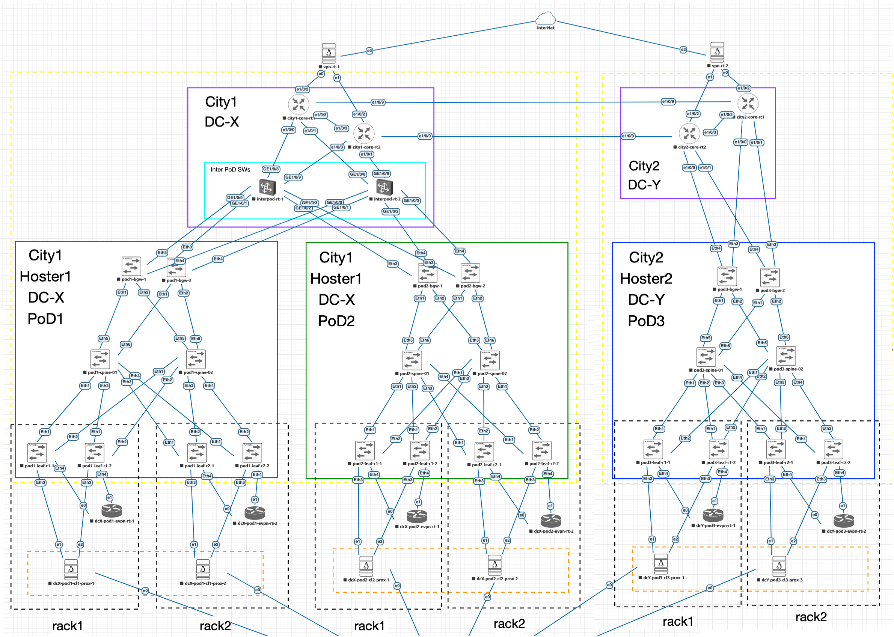
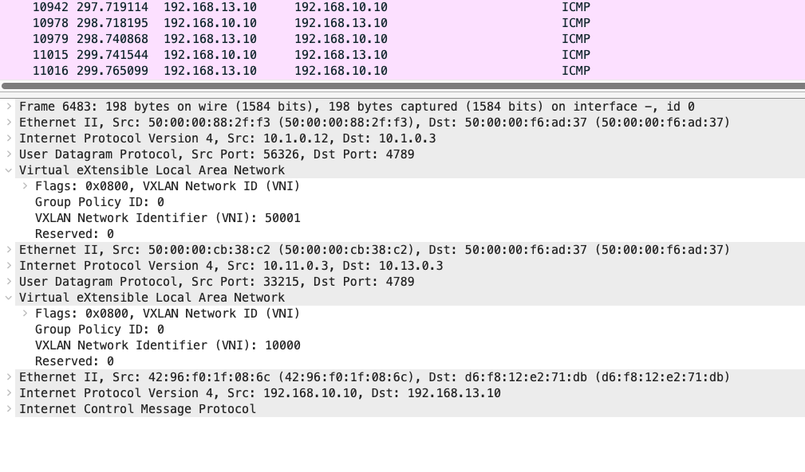

# Выпускной проект: Multi-DC SDN Overlay

## Тема: «Построение распределённой EVPN VXLAN Overlay-сети на основе Linux FRR для системы виртуализации Proxmox поверх EVPN VXLAN IP-фабрик PoD-ов Дата-центров»

## Цель

Построить собственный SDN overlay для Proxmox поверх хостерских EVPN VXLAN CLOS-фабрик, к которым нет административного доступа, и обеспечить связность VM:

- внутри одного PoD;
- между PoD одного дата-центра;
- между двумя городами и двумя дата-центрами.

## Что реально реализовано

- Смоделированы 3 PoD: `PoD1`, `PoD2` в `City1 / DC-X` и `PoD3` в `City2 / DC-Y`.
- Внутри каждого PoD используется хостерская Arista EVPN VXLAN fabric.
- Поверх неё поднят собственный overlay Proxmox SDN EVPN.
- Меж-PoD транспорт реализован через `interpod-rt-1/2` на Huawei CE12000.
- Между городами транспорт реализован через `city1-core-rt1/rt2` и `city2-core-rt1/rt2` на Huawei NE40.
- Linux FRR-узлы `evpn-rt` выполняют роль RR для PVE и точек cross-PoD EVPN peering.
- По артефакту `explain/double_overlay.png` подтверждена двухуровневая инкапсуляция: внутренний Proxmox VXLAN поверх внешнего hoster VXLAN.

## Схема сети



## Актуальная архитектура реализации

| Слой | Реализация | Что важно |
|---|---|---|
| Hoster underlay | Arista Spine/Leaf/BGW | Изолирован внутри PoD, underlay адреса `10.1.x.x`, `10.2.x.x`, `10.3.x.x` наружу не экспортируются |
| Hoster tenant VRF | `TENANT-X`, `TENANT-Y`, `TENANT-Z` | Для PoD1/PoD2/PoD3 используются `L3VNI 50001/50002/50003` |
| Border routing | Arista BGW | В сторону нашего ядра фабрика представляется как `AS 64501/64502/64503` через `local-as ... no-prepend replace-as` |
| InterPoD transport | Huawei CE12000 | `interpod-rt-1/2`, `AS 65012`, связывают PoD1/PoD2 с Core |
| Inter-DC core | Huawei NE40 | `city1-core = AS 65011`, `city2-core = AS 65021` |
| Linux EVPN control plane | FRR на `evpn-rt-*` | `AS 65501/65502/65503` по PoD, cross-PoD peering и RR для Proxmox |
| Proxmox hosts | PVE + FRR | iBGP EVPN к локальным `evpn-rt`, VM overlay внутри Proxmox SDN |

## Что было синхронизировано по конфигам

Старая версия описания уже расходилась с фактической реализацией. По текущим конфигам в `project/configs/` зафиксировано:

- `city1-core` работает в `AS 65011`, `interpod` в `AS 65012`, `city2-core` в `AS 65021`.
- Spine-коммутаторы работают в `AS 65401`, `65402`, `65403`, а не в `6550x`.
- Leaf/BGW внутри PoD имеют собственные ASN `65511+`, `65521+`, `65531+`.
- Внешний AS хостерской tenant VRF для нашего ядра: `64501`, `64502`, `64503`.
- Tenant L3VNI в hoster fabric различаются по PoD: `50001`, `50002`, `50003`.
- Linux-сторона пирится по `bond0`-адресам `10.11/10.12/10.13.0.x`, а не по loopback.
- В capture `double_overlay.png` видны:
  - внешний VXLAN хостера с `VNI 50001`;
  - внутренний VXLAN Proxmox с `VNI 10000`;
  - транспорт между Linux-нодами по адресам `10.11.0.3 -> 10.13.0.3`.

## Сводка по PoD

| PoD | Локация | Hoster VRF | Hoster VRF AS | Hoster L3VNI | Server AS | Server aggregate | Tenant VM prefix |
|---|---|---|---|---|---|---|---|
| PoD1 | City1 / DC-X | `TENANT-X` | `64501` | `50001` | `65501` | `10.11.0.0/16` | `192.168.10.0/23` |
| PoD2 | City1 / DC-X | `TENANT-Y` | `64502` | `50002` | `65502` | `10.12.0.0/16` | `192.168.20.0/23` |
| PoD3 | City2 / DC-Y | `TENANT-Z` | `64503` | `50003` | `65503` | `10.13.0.0/16` | `192.168.30.0/23` |

## Как устроен control plane

### 1. Server attachment: ESI-LAG + /31 anycast

Каждый `PVE` и `EVPN-RT` подключён к паре leaf через LACP bond.  
На leaf парах используются anycast `/31` gateway-адреса в tenant VRF:

```text
PoD1 rack1:
leaf pair -> Vlan110 anycast 10.11.0.0/31 -> dcX-pod1-evpn-rt-1 bond0 10.11.0.1/31
leaf pair -> Vlan111 anycast 10.11.0.2/31 -> dcX-pod1-pve-1     bond0 10.11.0.3/31
```

Та же схема повторяется для `PoD2` и `PoD3`.

### 2. PVE <-> EVPN-RT

В текущем варианте iBGP EVPN между Proxmox и `evpn-rt` поднимается по `bond0`-адресам через маршрутизацию на leaf в tenant VRF:

```text
PVE bond0 -> leaf VRF TENANT-* -> EVPN-RT bond0
10.11.0.3  -> leaf pair         -> 10.11.0.1
```

Прямого отдельного линка `PVE <-> EVPN-RT` в лабораторной топологии нет.

### 3. Cross-PoD EVPN

`evpn-rt` разных PoD пирятся напрямую по `eBGP multihop`:

```text
PoD1 AS65501 <-> PoD2 AS65502 <-> PoD3 AS65503
```

При этом в конфигах используются именно transport endpoints:

- `PoD1`: `10.11.0.1`, `10.11.0.5`
- `PoD2`: `10.12.0.1`, `10.12.0.5`
- `PoD3`: `10.13.0.1`, `10.13.0.5`

### 4. Hoster BGW <-> Our core

BGW анонсируют наружу server-агрегаты:

- `PoD1 -> 10.11.0.0/16`
- `PoD2 -> 10.12.0.0/16`
- `PoD3 -> 10.13.0.0/16`

Именно эти префиксы обеспечивают достижимость Linux transport endpoints между PoD и между городами.

## Double overlay: что именно происходит в data plane

По capture `explain/double_overlay.png` пакет между VM в разных PoD проходит в два слоя VXLAN:

```text
ICMP 192.168.10.10 -> 192.168.13.10
  inside Proxmox VXLAN VNI 10000
    src/dst Linux transport IP: 10.11.0.3 -> 10.13.0.3
      inside hoster VXLAN VNI 50001
        src/dst hoster underlay IP: 10.1.0.12 -> 10.1.0.3
```

Это и есть ключевая идея проекта: собственный overlay Proxmox не требует доступа к управлению хостерской EVPN fabric и переносится поверх уже существующего overlay хостера.



## Адресация: краткая сводка

Полный адресный план: [ADDRESSING_PLAN.md](ADDRESSING_PLAN.md)

| Слой | Диапазон | Назначение |
|---|---|---|
| Hoster underlay PoD1 | `10.1.0.0/16` | Loopback и p2p внутри PoD1 |
| Hoster underlay PoD2 | `10.2.0.0/16` | Loopback и p2p внутри PoD2 |
| Hoster underlay PoD3 | `10.3.0.0/16` | Loopback и p2p внутри PoD3 |
| Server transport PoD1 | `10.11.0.0/16` | `bond0` Linux-узлов, service loopback, экспорт через BGW |
| Server transport PoD2 | `10.12.0.0/16` | То же для PoD2 |
| Server transport PoD3 | `10.13.0.0/16` | То же для PoD3 |
| Tenant VM overlay | `192.168.10.0/23`, `192.168.20.0/23`, `192.168.30.0/23` | Сети VM в Proxmox SDN |
| Core / transport p2p | `172.16.1.0/31`, `172.16.2.0/31`, `172.16.3.0/31`, `172.16.10.0/31`, `172.16.100.0/31` | BGW <-> interpod/core и inter-DC |
| Core loopbacks | `172.16.255.1-6/32` | Router-ID ядра |

## Инвентарь проектных артефактов

```text
project/
├── README.md                    — актуальное описание проекта
├── ADDRESSING_PLAN.md           — полный адресный план
├── PRESENTATION_PLAN.md         — план защиты на 10–12 слайдов
├── scheme.png                   — общая топология
├── OverOverlay EVPN VXLAN fabric.svg
├── concept.md                   — исходная концепция
├── explain/                     — заметки и иллюстрации
└── configs/
    ├── pod1/                    — Arista EOS, PoD1
    ├── pod2/                    — Arista EOS, PoD2
    ├── pod3/                    — Arista EOS, PoD3
    ├── core/                    — Huawei VRP, transport/core
    ├── evpn-routers/            — Linux FRR, EVPN-RT
    └── proxmox/                 — PVE interfaces, FRR sample, SDN notes
```

## Связанные документы

- [Полный адресный план](ADDRESSING_PLAN.md)
- [План презентации для защиты](PRESENTATION_PLAN.md)
- `configs/proxmox/proxmox-sdn.cfg` — поясняющие заметки по Proxmox SDN
- `explain/config_*.md` — короткие технологические заметки по EVPN/SDN
